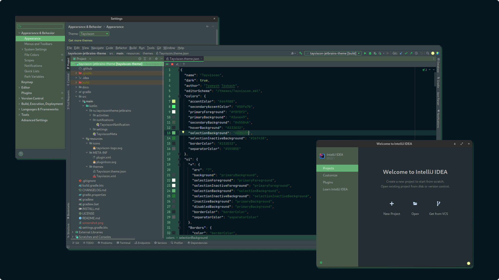

# Tayviscon for [JetBrains IDE](https://www.jetbrains.com/)

> A tayviscon theme for [JetBrains IDE](https://www.jetbrains.com/)

## Install 

All instructions can be found at [theme repository](https://github.com/tayviscon/tayviscon-jetbrains-theme/blob/main/INSTALL.md)

## Team
This theme is maintained by the following person(s) and a bunch
of [awesome contributors](https://github.com/tayviscon/tayviscon-jetbrains-theme/graphs/contributors).

|  |
|----------------------------------------------------------------------------------------------------------|
| [Tayviscon](https://github.com/tayviscon)                                                                |

## Community

## License
[MIT License](./LICENSE)
